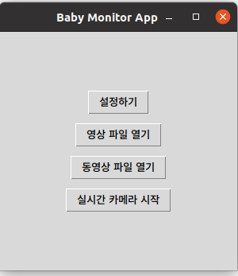
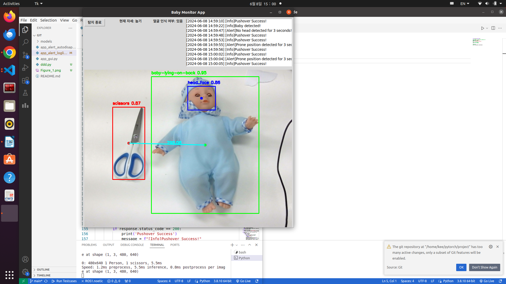

# kookmin_babycare

2024-1 전자공학종합설계(정성희 교수) 
3조 기운찬, 권수정

How to run: 
 run app_kookmin_babycare.py

화면 세팅은 1080p 기준으로 만들어짐.

Used DATASET: 
    [1] Sabicare, Sabicare Merged Computer Vision Project[DATASET], https://universe.roboflow.com/sabicare/sabicare-merged 
    [2] KOSAKorea Softwareindustry Association, bebeface Computer Vision Project[DATASET], https://universe.roboflow.com/kosakorea-softwareindustry-association/bebeface 
    [3] Eitan, Knives and scissors training Computer Vision Project[DATASET], https://universe.roboflow.com/eitan/knives-and-scissors-training
